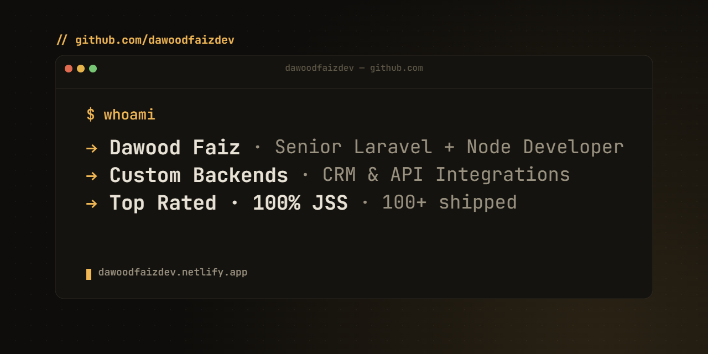

# Hi, I'm Dawood Faiz 👋

**Senior Laravel + Node Developer** · Custom Backends &amp; CRM Integrations
**Top Rated on [Upwork](https://www.upwork.com/freelancers/dawoodfaizdev)** · 100+ shipped · 100% job-success score
🌐 **[dawoodfaizdev.netlify.app](https://dawoodfaizdev.netlify.app)**

---

### What I do best

I'm a senior backend engineer specializing in custom REST API integrations, CRM automation, and backend systems for SMB SaaS founders. If you've been burned by a developer before — vague communication, missed deadlines, code your team can't read — that's the gap I fill.

- **Custom backends & REST APIs** — Laravel, Node.js, Express, PHP
- **CRM integrations end-to-end** — GoHighLevel, Zenoti, MindBody, Boulevard, PatientNow, Konnektive, Checkout Champ, ActiveCampaign, Shopify, WooCommerce + more
- **GoHighLevel API v1 → v2 migrations** — rebuilding integrations on the new v2 API before v1 fully sunsets
- **AI integration into existing products** — OpenAI, Claude API, n8n, Make.com, Zapier
- **Real-time analytics dashboards** — including Meta Marketing API
- **Performance audits & code rescue** — recent job cut load times by 60%+
- **Full-stack web apps** when the project needs one person who owns it all

### Recent proof

- **Email Game Changers AI** — Built an AI-powered SaaS for a US copywriter with 5,000+ paying subscribers ($97/month)
- **Trivvo · GHL White-Label Dashboard** — Custom Laravel admin panel integrated with GoHighLevel, 5★ Upwork, repeat client
- **Snap Fitness · GHL Automation Rescue** — Took over after 3 failed freelancers, audited and rebuilt the workflow stack, 5★ Upwork
- **GHL API Auth Fix** — Diagnosed and fixed an authentication issue in hours that the previous developer called "beyond his ability"

### Tech I reach for

```
Backend     PHP · Laravel · Livewire · Node.js · Express · TypeScript
Frontend    Vue.js · React · Inertia · Alpine.js · Tailwind CSS
Database    MySQL · PostgreSQL · MongoDB · SQLite
DevOps      Docker · AWS · Git · cPanel / WHM
AI / Auto   OpenAI · Claude API · n8n · Make.com · Zapier
Payments    Stripe · subscription billing · webhook architecture
```

### How I work

- **Clear weekly communication** — no jargon, no ghosting, no surprises
- **Senior-level architecture** — clean, secure, maintainable code that survives team handoffs
- **Honest scoping** — if something is outside scope or outside my expertise, I say so before we start
- **Money-back guarantee** — if the agreed deliverable isn't right, you don't pay

### Open to

- Long-term **retainers** with international teams ($30–35/hr or $4K+/mo)
- **Remote roles** where backend ownership matters
- **Rescue work** on messy Laravel / Node / PHP codebases

### Reach me

- ✉ **dawoodfaiz.2@gmail.com**
- 💼 **[Upwork](https://www.upwork.com/freelancers/dawoodfaizdev)** — Top Rated, 100% JSS
- 🌐 **[Portfolio](https://dawoodfaizdev.netlify.app)** — case studies + selected work
- 🔗 **[LinkedIn](https://www.linkedin.com/in/dawoodfaizdev/)**
- 🐦 **[X / Twitter](https://x.com/dawoodfaizdev)**

---

> _"Your next web project deserves more than a developer. It deserves an owner."_

---

<!-- Tech badges — static shields.io, never rate-limited or broken -->


<!--
  NOTE: the github-readme-stats.vercel.app cards are intentionally NOT used here.
  The public instance is heavily rate-limited and frequently renders as broken
  images. If you really want live stats, self-host github-readme-stats on your
  own Vercel account (free) and point the URLs at your deployment — then it's
  reliable. The static badges above never break.
-->
